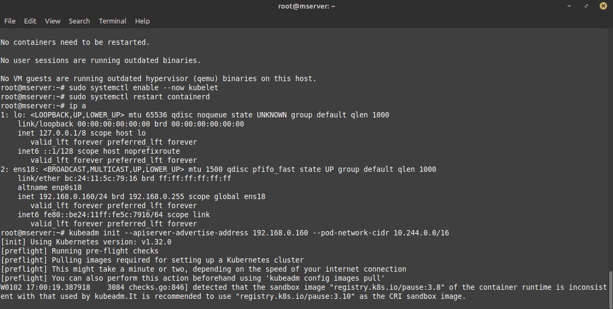
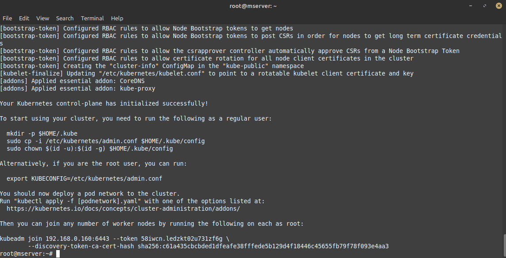

# Kubernetes-Cluster-Creation

## [Kubeadm](https://kubernetes.io/docs/setup/production-environment/tools/)

### [Before you begin](https://kubernetes.io/docs/setup/production-environment/tools/kubeadm/install-kubeadm/) 
- A compatible Linux host.
- 2 GB or more of RAM per machine.
- 2 CPUs or more for control plane machines and minimum 1 for worker node.
- Full network connectivity between all machines in the cluster. (ping test)
- Unique hostname, MAC address, and product_uuid for every node.([Change IP & Hostname](unique.md))
- Certain [ports](https://kubernetes.io/docs/reference/networking/ports-and-protocols/) are open on your machines.

--- 
# For All Nodes

- Switch to root
```bash
sudo -i
```

## Install and configure prerequisites

### Swap configuration
The default behavior of a kubelet is to fail to start if swap memory is detected on a node.

```bash
swapoff -a 
(crontab -l 2>/dev/null; echo "@reboot /sbin/swapoff -a") | crontab - || true
```

### [Network configuration](https://kubernetes.io/docs/setup/production-environment/container-runtimes/#install-and-configure-prerequisites)   
By default, the Linux kernel does not allow IPv4 packets to be routed between interfaces. Most Kubernetes cluster networking implementations will change this setting (if needed), but some might expect the administrator to do it for them. (Some might also expect other sysctl parameters to be set, kernel modules to be loaded, etc; consult the documentation for your specific network implementation.)

```bash
cat <<EOF | sudo tee /etc/modules-load.d/k8s.conf
overlay
br_netfilter
EOF
```

```bash
sudo modprobe overlay
sudo modprobe br_netfilter
```

```bash
cat <<EOF | sudo tee /etc/sysctl.d/k8s.conf
net.bridge.bridge-nf-call-iptables  = 1
net.bridge.bridge-nf-call-ip6tables = 1
net.ipv4.ip_forward                 = 1
EOF
```

- Apply sysctl params without reboot
```bash
sudo sysctl --system
```

Verify that net.ipv4.ip_forward is set to 1 with:
```bash
sysctl net.ipv4.ip_forward
sysctl net.bridge.bridge-nf-call-iptables
sysctl net.bridge.bridge-nf-call-ip6tables
```

---
## [Container Runtimes](https://kubernetes.io/docs/setup/production-environment/container-runtimes/)      
### containerd
- Add Docker's official GPG key:
```bash
sudo apt-get update
sudo apt-get install ca-certificates curl
sudo install -m 0755 -d /etc/apt/keyrings
sudo curl -fsSL https://download.docker.com/linux/ubuntu/gpg -o /etc/apt/keyrings/docker.asc
sudo chmod a+r /etc/apt/keyrings/docker.asc
```
- Add the repository to Apt sources:
```bash
echo \
  "deb [arch=$(dpkg --print-architecture) signed-by=/etc/apt/keyrings/docker.asc] https://download.docker.com/linux/ubuntu \
  $(. /etc/os-release && echo "$VERSION_CODENAME") stable" | \
  sudo tee /etc/apt/sources.list.d/docker.list > /dev/null
```
```bash
sudo apt-get update
```

- To install the latest version, run:
```bash
sudo apt-get install containerd.io
```

### Configuring the cgroup driver [(systemd)](https://kubernetes.io/docs/setup/production-environment/container-runtimes/#container-runtimes) 

Cgroup Drivers manage how system resources (CPU, memory, I/O) are allocated to processes via cgroups (control groups) in Linux.   
There are two cgroup drivers available:
- cgroupfs
- systemd

Since many modern Linux distributions use `systemd` as the init system, using it as the cgroup manager ensures better consistency across the system.
By using `systemd`, container runtimes like Docker or containerd do not need to manage cgroups separately.


Consider resetting the containerd configuration:  
```bash
containerd config default > /etc/containerd/config.toml
```
```
nano /etc/containerd/config.toml
```
set SystemdCgroup to `true`

Make sure to restart containerd:
```
sudo systemctl restart containerd

```

---

## [Installing kubeadm, kubelet and kubectl](https://kubernetes.io/docs/setup/production-environment/tools/kubeadm/install-kubeadm/#installing-kubeadm-kubelet-and-kubectl)

You will install these packages on all of your machines:

`kubeadm`, `kubelet`& `kubectl`

These instructions are for Kubernetes v1.32.

Update the apt package index and install packages needed to use the Kubernetes apt repository:   
```bash
sudo apt-get update
```

<br>

apt-transport-https may be a dummy package; if so, you can skip that package   

```bash
sudo apt-get install -y apt-transport-https ca-certificates curl gpg
```

Download the public signing key for the Kubernetes package repositories. The same signing key is used for all repositories so you can disregard the version in the URL:

```bash
# If the directory `/etc/apt/keyrings` does not exist, it should be created before the curl command, read the note below.
# sudo mkdir -p -m 755 /etc/apt/keyrings
```

```
curl -fsSL https://pkgs.k8s.io/core:/stable:/v1.32/deb/Release.key | sudo gpg --dearmor -o /etc/apt/keyrings/kubernetes-apt-keyring.gpg
```

Add the appropriate Kubernetes apt repository. Please note that this repository have packages only for Kubernetes 1.32; for other Kubernetes minor versions, you need to change the Kubernetes minor version in the URL to match your desired minor version (you should also check that you are reading the documentation for the version of Kubernetes that you plan to install).

This overwrites any existing configuration in /etc/apt/sources.list.d/kubernetes.list
```bash
echo 'deb [signed-by=/etc/apt/keyrings/kubernetes-apt-keyring.gpg] https://pkgs.k8s.io/core:/stable:/v1.32/deb/ /' | sudo tee /etc/apt/sources.list.d/kubernetes.list
```
Update the apt package index, install kubelet, kubeadm and kubectl, and pin their version:
```bash
sudo apt-get update
```
```bash
sudo apt-get install -y kubelet kubeadm kubectl
```
```bash
sudo apt-mark hold kubelet kubeadm kubectl
```
(Optional) Enable the kubelet service before running kubeadm:
```bash
sudo systemctl enable --now kubelet
```

---
# For Controller Only
## Initializing your control-plane node 

```bash
sudo systemctl restart containerd
```
```bash
kubeadm init --apiserver-advertise-address <your-node-ip> --pod-network-cidr 10.244.0.0/16
```





<br>

Wait for 10-15 minutes.
<br>





<br><br>


Your Kubernetes control-plane has initialized successfully!

To start using your cluster, you need to run the following as a regular user:

- **Switch to normal User**

```bash
su <user-name>
```
```bash
mkdir -p $HOME/.kube
sudo cp -i /etc/kubernetes/admin.conf $HOME/.kube/config
sudo chown $(id -u):$(id -g) $HOME/.kube/config
```
You should now deploy a Pod network to the cluster.
Run "kubectl apply -f [podnetwork].yaml" with one of the options listed at:
  /docs/concepts/cluster-administration/addons/

You can now join any number of machines by running the following on each node
as root:

```bash
kubeadm join 192.168.0.160:6443 --token 58iwcn.ledzkt02u731zf6g \
	--discovery-token-ca-cert-hash sha256:c61a435cbcbded1dfeafe38fffede5b129d4f18446c45655fb79f78f093e4aa3
```

```bash
kubectl get nodes
```

```bash
kubectl get pods -A
```

---
## Network Addon for DNS (kube-flannel)

```bash
wget https://github.com/flannel-io/flannel/releases/latest/download/kube-flannel.yml
```

```bash
ip a
```

```bash
sudo nano kube-flannel.yml
```

You need to edit the kube-flannel-ds-amd64 DaemonSet, adding the cli option - --iface=ens18 under the kube-flannel container spec.


```bash
kubectl apply -f kube-flannel.yml
```

---
## Testing

- Add worker nodes to pod check run following on controller node

```bash
kubectl get nodes
```


```bash
kubectl run hello-world --image=hello-world
```

```bash
 kubectl get pods -o wide
```

```bash
kubectl logs hello-world
```
