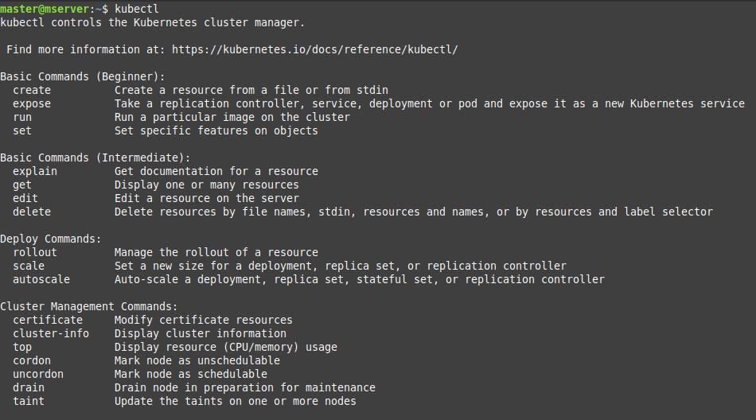
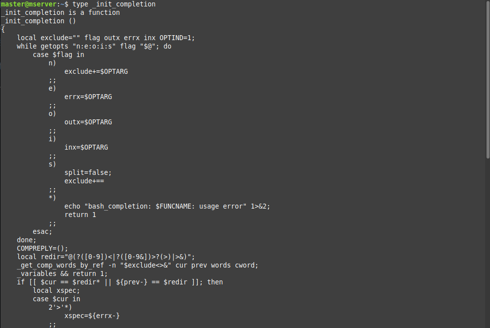
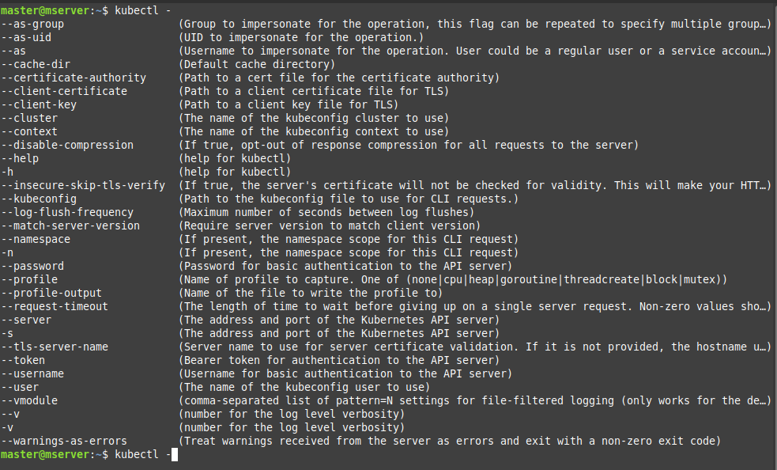
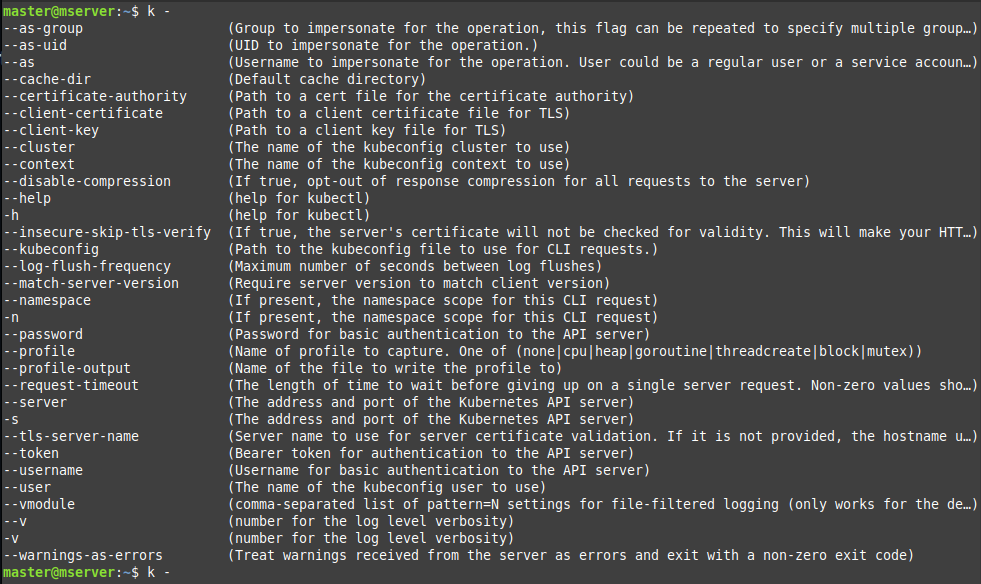

# Enable Auto-Completion for Kubectl in a Linux Bash Shell

Auto-completion for `kubectl` helps speed up your workflow by suggesting commands, flags, and resource names as you type. 
It reduces typing errors and makes it easier to discover available commands and options, improving efficiency. With auto-completion, you can quickly finish commands without needing to remember every detail.

### Benefits:
- **Saves time**: Completes commands for you.
- **Reduces errors**: Prevents typos in commands.
- **Easier exploration**: Helps you discover options and resources.

### Step-1:  Install Kubectl on Linux   

  Make sure that `Kubectl` is pre installed on your master node, to check type `kubectl` in your node CLI. 
  
  
  
  
  If not found then click here to see [steps](https://github.com/Tariq-Mehmood-Malik/Kubernetes-Cluster-Creation/tree/main?tab=readme-ov-file#installing-kubeadm-kubelet-and-kubectl) to install it.


### Step-2:  Install Auto-completion   

  Check Auto-completion is installed on your node by typing `type _init_completion`. 
  
  
  
  
  - To install auto-complete execute this command.
    
    ```bash
    sudo apt-get install bash-completion
    ```
    
  - Check Auto-completion is installed successfully.
    
    ```bash
    type _init_completion
    ```

### Step-3:  Set up Auto-completion for kubectl   

  - Set the kubectl completion script source for your shell sessions & for all users on the system:
    
    ```bash
    kubectl completion bash | sudo tee /etc/bash_completion.d/kubectl > /dev/null
    ```

  - After setting up the completion script, source your `.bashrc` file to apply the changes:
    
    ```bash
    source ~/.bashrc
    ```

  - Start a new bash session:
    
    ```bash
    bash
    ```
    
  - Type `kubectl -` followed by pressing tab twice to see the available options and verify auto-complete is working:
    
    ```bash
    kubectl -  # Press tab twice
    ```

    

 

### Step-4: Set up an alias for kubectl and enable auto-completion 

  - Set an alias for kubectl as `k`.
    
    ```bash
    echo 'alias k=kubectl' >>~/.bashrc
    ```
    
  - Enable the alias for auto-completion.
    
    ```bash
    echo 'complete -o default -F __start_kubectl k' >>~/.bashrc
    ```

  - After setting up, source your .bashrc file to apply the changes:
    
    ```bash
    source ~/.bashrc
    ```

  - Start a new bash session:
    
    ```bash
    bash
    ```

  - Type `k -` followed by pressing tab twice to see the available options and verify auto-complete is working with the alias.
    
    ```bash
    k -  # Press tab twice
    ```

  
    

---


